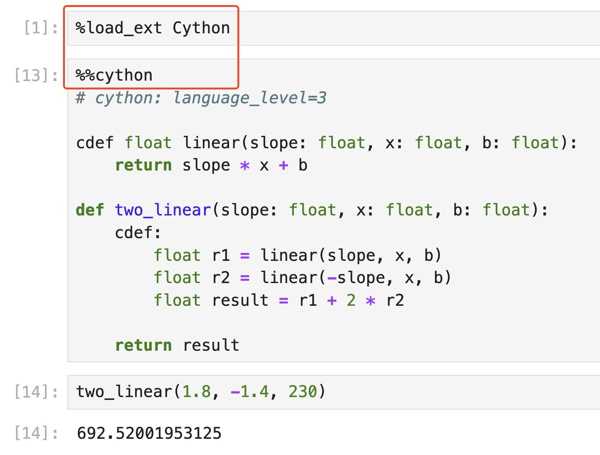

title: Pushing Cython to its Limits in Scikit-learn
use_katex: False
class: title-slide

# Pushing Cython to its Limits in Scikit-learn

.larger[Thomas J. Fan]<br>
<a href="https://www.github.com/thomasjpfan" target="_blank" class="title-link"><span class="icon icon-github right-margin"></span>@thomasjpfan</a>
<a class="this-talk-link", href="https://github.com/thomasjpfan/pydata-nyc-2024-cython-in-scikit-learn" target="_blank">github.com/thomasjpfan/pydata-nyc-2024-cython-in-scikit-learn</a>

---

class: top

<br>

# Me

- Senior Machine Engineer @ Union.ai

.g.g-middle[
.g-6.g-end[

]
.g-6.g-start[

]
]

--

- Maintainer for scikit-learn

.center[

]

---

# Agenda 📓

- Why Cython? 🚀
- Cython 101 🍀
- Scikit-learn Use Cases 🛠️

---

class: chapter-slide

# Why Cython? 🚀

---

# Why Cython? 🚀

.g.g-middle[
.g-6[
## Speed
- Reduce Memory Usage
- Improve CPU Usage
]
.g-6[

]
]


---

# Why Cython? 🚀
## Profiling

## Improving existing code
- Already have code to profile

## Writing new code
- Use libraries team is familiar with as a first pass


--

- `cProfile` + snakeviz
- `viztracer`
- `memray`
- `Scalene`

---
---

class: chapter-slide

# Cython 101 🍀

---

# Cython 101 🍀

- Compiling
- Types
- Developing Tips

---

# Compiling

```python
# simple.pyx

def add(x, y):
    return x + y
```

--

```python
from setuptools import setup
from Cython.Build import cythonize

setup(
    ext_modules=cythonize("simple.pyx"),
)
```

```bash
python setup.py build_ext --inplace
```

---

# Importing from Python code

```python
import simple

result = simple.add(10, 12)

print(result)
```

--

## Current Benefits

- Removes the Python interpreter

---

# Adding Types

```python
# simple.pyx

def add(x: int, y: int):
    return x + y
```

--

## Benefits

- Removes the Python interpreter
- Compiler can optimize with types

---

# Defining Functions

- `def` : Call from Python
- `cdef` : Call from Cython
- `cpdef` : Call from Python & Cython

--

```python
*cdef float linear(slope: float, x: float, b: float):
    return slope * x + b

def two_linear(slope: float, x: float, b: float):
    cdef:
*       float r1 = linear(slope, x, b)
*       float r2 = linear(-slope, x, b)
*       float result = r1 + 2 * r2

    return result
```

---

# Developing
## Annotation

```bash
cython --annotate simple.pyx
```


---

# Working in Jupyter



---

# Working in Jupyter (Annotation)


---

class: chapter-slide

# Scikit-learn Use Cases 🛠️

---

# Scikit-learn Use Cases 🛠️

- Python <> Cython interface
- Performance Features

---

# Python <> Cython interface - NumPy Arrays

```python
%% cython
*def add_value(float[:, :] X, float value):
	...
```

```python
import numpy as np
y = np.ones(shape=(3, 2), dtype=np.float32)

result = add_value(y, 1.4)
```

--

## Python Buffer Protocol

- Python [Buffer Protocol](https://docs.python.org/3/c-api/buffer.html)

---

# Python <> Cython interface - NumPy Arrays
## Write loops!

```python
%% cython
def add_value(double[:, :] X, double value):
    cdef:
        size_t i, j
        size_t N = X.shape[0]
        size_t M = X.shape[1]

    for i in range(N):
        for j in range(M):
            X[i, j] += value
```

--

## It's okay! 😆

---

# Scikit-learn Optimizations for memoryviews
## Directives!

```python
scikit_learn_cython_args = [
  '-X language_level=3',
  '-X boundscheck=' + boundscheck,
  '-X wraparound=False',
  '-X initializedcheck=False',
  '-X nonecheck=False',
  '-X cdivision=True',
  '-X profile=False',
```

.footnote[
[Source](https://github.com/scikit-learn/scikit-learn/blob/main/sklearn/meson.build#L183-L190)
]

---

# Memoryview directives (`boundscheck=True`)

```python
%%cython --annotate
# cython: language_level=3

def add_one(float[:, :] X):
    X[0, 0] += 1
```


---


# Memoryview directives (`boundscheck=False`)

```python
@cython.boundscheck(False)
def add_one(float[:, :] X):
    X[0, 0] += 1
```


---

# Memoryview directives (`wraparound=True`)

```python
@cython.boundscheck(False)
def add_one(float[:, :] X):
    X[0, 0] += 1
```


---

# Memoryview directives (`wraparound=False`)

```python
@cython.boundscheck(False)
@cython.wraparound(False)
def add_one_bad(float[:, :] X):
    cdef:
        float[:, :] X_ref = X
    X[0, 0] += 1
```

---

# Cython directives
## Define per file

```python
# cython: language_level=3
# cython: boundscheck=False
# cython: wraparound=False
cimport cython

...
```

---

# scikit-learn configuration
## Dynamic configure `boundscheck` for testing

```python
scikit_learn_cython_args = [
  '-X language_level=3',
  '-X boundscheck=' + boundscheck,
```

---

# Returning memoryviews

```python
def _make_unique(...):
    cdef floating[::1] y_out = np.empty(unique_values, dtype=dtype)

	# Compute

    return(
        np.asarray(x_out[:i+1]), ...
    )
```

.footnote[

]

---

# Strides 1D

- `float[:]` - Unknown contiguous
- `float[::1]` - Contiguous 1D

<!-- TODO: Picture of the two options -->

---

# Strides 2D

- `float[:, ::1]` - C contiguous
- `float[::1, :]` - F contiguous

<!-- TODO: Picture of the two options -->

---

# Const memoryviews
## Support readonly data

```python
cpdef floating _inertia_dense(
*       const floating[:, ::1] X,           # IN
*       const floating[::1] sample_weight,  # IN
        const floating[:, ::1] centers,     # IN
        const int[::1] labels,              # IN
        int n_threads,
        int single_label=-1,
):
```
`KMeans`, `BisectingKMeans`

.footnote[
[Source](https://github.com/scikit-learn/scikit-learn/blob/master/sklearn/cluster/_k_means_common.pyx#L94-L101)
]

---

# Const memoryviews
## Support readonly data - Use case

<!-- Show readonly with SuccessiveHalving -->

---

# Structs

```python
cdef struct BuildPrunedRecord:
    intp_t start
    intp_t depth
    intp_t parent
    bint is_left
```

.footnote[

]

---

# Packed Structs for memoryviews

```python
cdef packed struct hist_struct:
    Y_DTYPE_C sum_gradients
    Y_DTYPE_C sum_hessians
    unsigned int count
```
https://github.com/scikit-learn/scikit-learn/blob/main/sklearn/ensemble/_hist_gradient_boosting/common.pxd#L12-L17

```python
HISTOGRAM_DTYPE = np.dtype([
    ('sum_gradients', Y_DTYPE),  # sum of sample gradients in bin
    ('sum_hessians', Y_DTYPE),  # sum of sample hessians in bin
    ('count', np.uint32),  # number of samples in bin
])
```
https://github.com/scikit-learn/scikit-learn/blob/main/sklearn/ensemble/_hist_gradient_boosting/common.pyx#L20-L24

---

# Packed Structs for memoryviews

```python
hist_struct [:, ::1] histograms = np.empty(
	shape=(self.n_features, self.n_bins),
	dtype=HISTOGRAM_DTYPE
)
```
https://github.com/scikit-learn/scikit-learn/blob/main/sklearn/ensemble/_hist_gradient_boosting/histogram.pyx#L141-L144

https://numpy.org/doc/stable/user/basics.rec.html


---

# "Cython classes": Extension Types

```python
cdef class Tree:
	cdef public intp_t n_features
	cdef intp_t* n_classes
	cdef public intp_t n_outputs
	...
	cdef Node* nodes
	cdef float64_t* value
```

- `DecisionTree{Regressor,Classifier}`
- `RandomForest{Regressor,Classifier}`
- `GradientBoosting{Regressor,Classifier}`

https://github.com/scikit-learn/scikit-learn/blob/main/sklearn/tree/_tree.pxd#L36-L54

---

# "Cython classes": Extension Types

```python
cdef class Tree:
    def __cinit__(self, intp_t n_features, cnp.ndarray n_classes, intp_t n_outputs):
        safe_realloc(&self.n_classes, n_outputs)
		...

	cdef int _resize_c(self, intp_t capacity=INTPTR_MAX) except -1 nogil:
		...
        safe_realloc(&self.nodes, capacity)

    def __dealloc__(self):
        free(self.n_classes)
		free(self.nodes)
		...
```

https://github.com/scikit-learn/scikit-learn/blob/master/sklearn/tree/_tree.pyx#L783

---

# Header files

```python
# common.pyx
cdef packed struct node_struct:
    Y_DTYPE_C value
    unsigned int count
    intp_t feature_idx
    X_DTYPE_C num_threshold
	...
```

## Imported from another file

```python
# _predictor.pyx
from .common cimport node_struct
```

https://github.com/scikit-learn/scikit-learn/blob/master/sklearn/ensemble/_hist_gradient_boosting/common.pxd#L20-L27
https://github.com/scikit-learn/scikit-learn/blob/master/sklearn/ensemble/_hist_gradient_boosting/_predictor.pyx#L13

---


---

# Releasing the GIL
## What is the GIL?

---

# Why Release the GIL

```python
trees = Parallel(
	n_jobs=self.n_jobs,
	verbose=self.verbose,
	prefer="threads",
)(
	delayed(_parallel_build_trees)(...)
```

- `RandomForest{Classifier,Regressor}`

---

# Releasing the Gil in Cython


```python
*with nogil:
	builder_stack.push(...)
	...
	node_id = tree._add_node(...)
	splitter.node_value(...)
```

https://github.com/scikit-learn/scikit-learn/blob/master/sklearn/tree/_tree.pyx#L213

---

# nogil in function definition

```python
cdef class Splitter:
    cdef void node_value(self, float64_t* dest) noexcept nogil
```

https://github.com/scikit-learn/scikit-learn/blob/master/sklearn/tree/_splitter.pxd#L102

---

class: chapter-slide

# Performance

---

# nan check

```python
has_inf = xp.any(xp.isinf(X))
has_nan = xp.any(xp.isnan(X))
```

--

```python
cdef inline FiniteStatus _isfinite_disable_nan(floating* a_ptr,
                                               Py_ssize_t length) noexcept nogil:
    for i in range(length):
        v = a_ptr[i]
        if isnan(v):
            return FiniteStatus.has_nan
        elif isinf(v):
            return FiniteStatus.has_infinite
    return FiniteStatus.all_finite
```

- Almost everywhere

https://github.com/scikit-learn/scikit-learn/blob/master/sklearn/utils/_isfinite.pyx#L40-L41

---


# OpenMP

```python
*for i in prange(data.shape[0], schedule='static', nogil=True, num_threads=n_threads):
	left, right = 0, binning_thresholds.shape[0]

	while left < right:
		middle = left + (right - left - 1) // 2
		if data[i] <= binning_thresholds[middle]:
			right = middle
		else:
			left = middle + 1

	binned[i] = left
```

- `HistGradientBoosting{Classifier,Regressor}`

https://github.com/scikit-learn/scikit-learn/blob/master/sklearn/ensemble/_hist_gradient_boosting/_binning.pyx#L49-L65

---

# Calling SciPy BLAS

```python
from scipy.linalg.cython_blas cimport sgemm, dgemm
```

```python
with nogil, parallel(num_threads=n_threads):
	for chunk_idx in prange(n_chunks, schedule='static'):
		_update_chunk_dense(...)
```

--

```python
cdef void _update_chunk_dense(...) nogil:
	_gemm(...)
```

https://github.com/scikit-learn/scikit-learn/blob/master/sklearn/cluster/_k_means_lloyd.pyx#L118

---

# C++ (Map)

```python
cdef class IntFloatDict:
    cdef cpp_map[intp_t, float64_t] my_map
```

https://github.com/scikit-learn/scikit-learn/blob/master/sklearn/utils/_fast_dict.pxd#L17-L20

```python
cdef class IntFloatDict:
    def append(self, intp_t key, float64_t value):
        # Construct our arguments
        cdef pair[intp_t, float64_t] args
        args.first = key
        args.second = value
        self.my_map.insert(args)
```

- `AgglomerativeClustering`,

https://github.com/scikit-learn/scikit-learn/blob/master/sklearn/utils/_fast_dict.pyx#L116

---

# C++ (Vector)

```python
from libcpp.vector cimport vector

def dbscan_inner(...):
    cdef vector[intp_t] stack

	while True:
		...
			stack.push_back(v)

		if stack.size() == 0:
			break
		i = stack.back()
		stack.pop_back()
```

- `DBSCAN`

https://github.com/scikit-learn/scikit-learn/blob/master/sklearn/cluster/_dbscan_inner.pyx#L32

---

# C++ (Vector)

```python
def _fit_encoding_fast(...):
	cdef:
        # Gives access to encodings without gil
        vector[double*] encoding_vec

    encoding_vec.resize(n_features)
    for feat_idx in range(n_features):
        current_encoding = np.empty(shape=n_categories[feat_idx], dtype=np.float64)
        encoding_vec[feat_idx] = &current_encoding[0]


```

- `TargetEncoder`

https://github.com/scikit-learn/scikit-learn/blob/master/sklearn/preprocessing/_target_encoder_fast.pyx#L20

---

# C++ Algorithm

```python
cpdef build(

```

https://github.com/scikit-learn/scikit-learn/blob/master/sklearn/tree/_tree.pyx#L468-L469

---

# Fused Types (Intro)

```python
cdef floating abs_max(int n, const floating* a) noexcept nogil:
    """np.max(np.abs(a))"""
    cdef int i
    cdef floating m = fabs(a[0])
    cdef floating d
    for i in range(1, n):
        d = fabs(a[i])
        if d > m:
            m = d
    return m
```

https://github.com/scikit-learn/scikit-learn/blob/master/sklearn/linear_model/_cd_fast.pyx#L50-L59

---

# Fused Types (Memoryview)

```python
ctypedef fused INT_DTYPE:
    int64_t
    int32_t

ctypedef fused Y_DTYPE:
    int64_t
    int32_t
    float64_t
    float32_t
```

--

```python
def _fit_encoding_fast(
    INT_DTYPE[:, ::1] X_int,
    const Y_DTYPE[:] y,
    int64_t[::1] n_categories,
    double smooth,
    double y_mean,
)
```

https://github.com/scikit-learn/scikit-learn/blob/master/sklearn/preprocessing/_target_encoder_fast.pyx#L17

---

# C++ Vector + Fused types into NumPy Array

```python
ctypedef fused vector_typed:
    vector[float64_t]
    vector[intp_t]
    vector[int32_t]
    vector[int64_t]

cdef cnp.ndarray vector_to_nd_array(vector_typed * vect_ptr):

cdef class StdVectorSentinelInt64:
    cdef vector[int64_t] vec
```

--

```python
cdef cnp.ndarray vector_to_nd_array(vector_typed * vect_ptr):
	cdef:
        StdVectorSentinel sentinel = _create_sentinel(vect_ptr)
        cnp.ndarray arr = cnp.PyArray_SimpleNewFromData(...)

		Py_INCREF(sentinel)
		cnp.PyArray_SetBaseObject(arr, sentinel)
		return arr
```

https://github.com/scikit-learn/scikit-learn/blob/master/sklearn/utils/_vector_sentinel.pxd#L6-L12

---

# Tempita


```python
# name_suffix, c_type
dtypes = [('64', 'double'),
          ('32', 'float')]

}}

{{for name_suffix, c_type in dtypes}}

cdef class WeightVector{{name_suffix}}(object):
    cdef readonly {{c_type}}[::1] w
    cdef readonly {{c_type}}[::1] aw
	...

{{endfor}}
```

--

## Generated Code

```python
cdef class WeightVector64(object):
    cdef readonly double[::1] w
    cdef readonly double[::1] aw

cdef class WeightVector32(object):
    cdef readonly float[::1] w
    cdef readonly float[::1] aw
```


https://github.com/scikit-learn/scikit-learn/blob/master/sklearn/utils/_weight_vector.pxd.tp#L21-L27

---

# Optimizing Performance (Virtual Table)
## The Problem

```python
cdef class CyLossFunction:

	def loss(self, ...)
		for i in prange(
			n_samples, schedule='static', nogil=True, num_threads=n_threads
		):
			loss_out[i] = self.single_loss(y_true[i], raw_prediction[i]{{with_param}})
```

--

```python
cdef class CyHalfSquaredError(CyLossFunction):

	cdef inline double self.single_loss(
		double y_true,
		double raw_prediction
	) noexcept nogil:
		return 0.5 * (raw_prediction - y_true) * (raw_prediction - y_true)

```

--

## Does not work!

--

## Solution - Do not be dynamic!

---

# Optimizing Performance (Virtual Table)
## Tempita

```python
cdef class {{name}}(CyLossFunction):

    def loss(...):
		for i in prange(
			n_samples, schedule='static', nogil=True, num_threads=n_threads
		):
			loss_out[i] = {{closs}}(y_true[i], raw_prediction[i]{{with_param}})
```

--

## Generated Code

```python
cdef class CyHalfSquaredError(CyLossFunction):

    def loss(...):
		for i in prange(
			n_samples, schedule='static', nogil=True, num_threads=n_threads
		):
*			loss_out[i] = closs_half_squared_error(y_true[i], raw_prediction[i])
```

https://github.com/scikit-learn/scikit-learn/blob/master/sklearn/_loss/_loss.pyx.tp#L1025

- `linear`, `GradientBoosting*`, `HistGradientBoosting*`

---

# Optimizing Performance (Virtual Table)
## Fused Types on classes

```python
ctypedef fused Partitioner:
    DensePartitioner
    SparsePartitioner
```

--

```python
cdef inline int node_split_best(
    Splitter splitter,
    Partitioner partitioner,
	...):
		partitioner.init_node_split(...)

		while ...:
			partitioner.find_min_max(...)
```

- `tree`, `RandomForest*`, `GradientBoosting*`

https://github.com/scikit-learn/scikit-learn/blob/master/sklearn/tree/_splitter.pyx#L40-L42

---

# Cython Features Covered Today

.g[
.g-6[
## Python <> Cython Interface
- Compiling
- Types
- Memoryviews
]
.g-6[
## Performance Features
- "Cython classes"
- C++
- Fused Types
- Tempita
]
]

---

# Performance Uplift

- `TargetEncoder` - 4-5x runtime and less memory usage compared to pure NumPy version
- `HistGradientBoosting*`: LightGBM-like performance
- `LogisticRegression`, `GammaRegressor`, `PoissonRegressor`, `TweedieRegressor`, `GradientBoosting*`
	- 2x improvement
- Almost all estimators in `cluster`, `manifold`, `neighbors`, `semi_supervised` modules
	- 20x improvement
- Reduce memory usage for nan-inf check

---


.g.g-middle[
.g-7[
.smaller[
# Pushing Cython to its Limits in Scikit-learn
]
- Why Cython? 🚀
- Cython 101 🍀
- Scikit-learn Use Cases 🛠️
]
.g-5.g-center[
.smaller[
]

Thomas J. Fan<br>
<a href="https://www.github.com/thomasjpfan" target="_blank" class="title-link"><span class="icon icon-github right-margin"></span>@thomasjpfan</a>
<a class="this-talk-link", href="https://github.com/thomasjpfan/pydata-nyc-2024-cython-in-scikit-learn" target="_blank">github.com/thomasjpfan/pydata-nyc-2024-cython-in-scikit-learn</a>

]
]


---

# Appendix

---

# Other Languages

.g[
.g-6[

.center[
## AOT

]

- **Ahead of time** compiled
- Harder to build
- Less requirements during runtime
]
.g-6[

.center[
## Numba

]

- **Just in time** compiled
- Source code is Python
- Requires compiler at runtime
]
]


---

# Finding Hot-spots 🔎
## `cProfile` + snakeviz

```bash
python -m cProfile -o hist.prof hist.py
snakeviz hist.prof
```


---

# Finding Hot-spots 🔎
## `viztracer`

```bash
viztracer hist.py
vizviewer result.json
```


---

# Memory Profiling 🧠
## `memray`

```bash
memray run np-copy.py
memray flamegraph memray-np-copy.py.88600.bin
```


---

# Memory Profiling 🧠
## `memray`


---

# Memory Profiling 🧠
## Scalene

```bash
scalene np-copy.py
```


