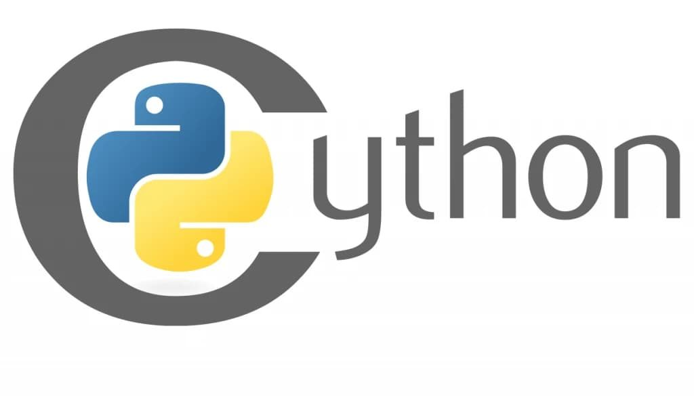
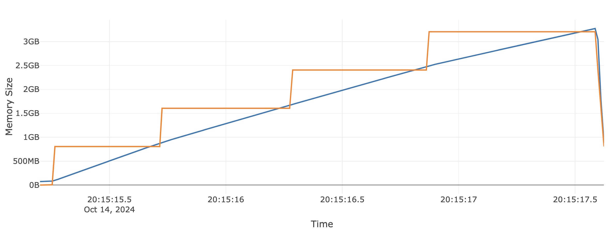

title: Pushing Cython to its Limits in Scikit-learn

use_katex: False
class: title-slide

# Pushing Cython to its Limits in Scikit-learn


.larger[Thomas J. Fan]<br>
<a href="https://www.github.com/thomasjpfan" target="_blank" class="title-link"><span class="icon icon-github right-margin"></span>@thomasjpfan</a>
<a class="this-talk-link", href="https://github.com/thomasjpfan/pydata-nyc-2024-cython-in-scikit-learn" target="_blank">github.com/thomasjpfan/pydata-nyc-2024-cython-in-scikit-learn</a>

---

class: top

<br>

# Me

- Senior Machine Engineer @ Union.ai

.g.g-middle[
.g-6.g-end[

]
.g-6.g-start[

]
]

--

- Maintainer for scikit-learn

.center[

]

---

.g.g-middle[
.g-6[
# Agenda 📓
## - Why Cython? 🚀
## - Cython 101 🍀
## - Scikit-learn Use Cases 🛠️
]
.g-6.g-center[

]
]

---


# Why Cython? 🚀

.g.g-middle[
.g-6.larger[
## Performance
### Improve Runtime 🏎️
### Reduce Memory 🧠
]
.g-6[

]
]
---

class: top

# Performance Uplift

.g.g-center[
.g-1[]
.g-5[

]
.g-5[

]
.g-1[]
]

- `HistGradientBoosting*`: **LightGBM**-like performance
- **2x improvement**: `LogisticRegression`, `linear_model` module, and `GradientBoosting*`


---

class: top

# Performance Uplift

.g.g-center[
.g-1[]
.g-5[

]
.g-5[

]
.g-1[]
]

- `HistGradientBoosting*`: **LightGBM**-like performance
- **2x improvement**: `LogisticRegression`, `linear_model` module, and `GradientBoosting*`
- **20x improvement** in `cluster`, `manifold`, `neighbors`, `semi_supervised` modules
- `TargetEncoder` - **4-5x runtime** and less memory usage
- **Reduce memory usage** for validation checks

---

.g.g-middle[
.g-6[
# Profiling 🔬
- `cProfile` + snakeviz
- `viztracer`
- `memray`
- `Scalene`
]
.g-6.g-center[

]
]

---

class: chapter-slide

# Cython 101 🍀

---

.g.g-middle[
.g-6[
# Cython 101 🍀

## - Compiling
## - Types
## - Developer Tips

]
.g-6[

]
]

---

class: top
<br>
# Compiling

```python
# simple.pyx

def add(x, y):
    return x + y
```

--

## `setup.py`

```python
from setuptools import setup
from Cython.Build import cythonize

setup(
    ext_modules=cythonize("simple.pyx"),
)
```

--

## Build Command

```bash
python setup.py build_ext --inplace
```

---

class: top

<br>
<br>

# Importing from Python code

```python
import simple

result = simple.add(10, 12)

print(result)
```

--

## Benefits
- Does not go through the Python Interpreter

```python
# simple.pyx

def add(x, y):
    return x + y
```


---

class: top

<br><br><br>

# Adding Types

```python
# simple.pyx

def add(x: int, y: int):
    return x + y
```

--

## Benefits

- Removes the Python interpreter
- Compiler can optimize with types

---

class: top

<br><br>

# Defining Functions

- `def` : Call from Python
- `cdef` : Call from Cython
- `cpdef` : Call from Python & Cython

--

```python
*cdef float linear(slope: float, x: float, b: float):
    return slope * x + b
```

--

```python
def two_linear(slope: float, x: float, b: float):
    cdef:
*       float r1 = linear(slope, x, b)
        float r2 = linear(-slope, x, b)
        float result = r1 + 2 * r2

    return result
```

---

# Developing
## Annotation

```bash
cython --annotate simple.pyx
```

.center[

]

---

# Working in Jupyter

.center[

]

---

# Working in Jupyter (Annotation)


---

class: chapter-slide

# Scikit-learn Use Cases 🛠️

---


.g.g-middle[
.g-6[
# Scikit-learn Use Cases 🛠️
- Python <-> Cython interface ⚙️
- Performance
	- Improve Runtime 🏎️
	- Reduce Memory 🧠
]
.g-6.g-center[

]
]

---

class: top

# Python <-> Cython interface - NumPy Arrays

.center[

]

```python
%% cython
*def add_value(float[:, :] X, float value):
	...
```

--

## Call from Python

```python
import numpy as np
y = np.ones(shape=(3, 2), dtype=np.float32)

result = add_value(y, 1.4)
```

--

## Python [Buffer Protocol](https://docs.python.org/3/c-api/buffer.html) 🔌

---

class: top

<br><br>

# Python <> Cython interface - NumPy Arrays
## Write loops!

```python
%% cython
def add_value(double[:, :] X, double value):
    cdef:
        size_t i, j
        size_t N = X.shape[0]
        size_t M = X.shape[1]

    for i in range(N):
        for j in range(M):
            X[i, j] += value
```

--

## It's okay! 😆

---

# Scikit-learn Optimizations for memoryviews
## Directives!

```python
scikit_learn_cython_args = [
  '-X language_level=3',
  '-X boundscheck=' + boundscheck,
  '-X wraparound=False',
  '-X initializedcheck=False',
  '-X nonecheck=False',
  '-X cdivision=True',
  '-X profile=False',
  ...
]
```

.footnote-back[
[meson.build](https://github.com/scikit-learn/scikit-learn/blob/main/sklearn/meson.build#L183-L190)
]

---

# Memoryview directives (`boundscheck=True`)

```python
%%cython --annotate
# cython: language_level=3

def add_one(float[:, :] X):
    X[0, 0] += 1
```


---


# Memoryview directives (`boundscheck=False`)

```python
*@cython.boundscheck(False)
def add_one(float[:, :] X):
    X[0, 0] += 1
```


---

# Memoryview directives (`wraparound=True`)

```python
@cython.boundscheck(False)
def add_one(float[:, :] X):
    X[0, 0] += 1
```


---

# Memoryview directives (`wraparound=False`)

```python
@cython.boundscheck(False)
*@cython.wraparound(False)
def add_one_bad(float[:, :] X):
    X[0, 0] += 1
```


---

class: top

<br><br>

# Cython directives
## Define for file 🗃️

```python
# cython: language_level=3
# cython: boundscheck=False
# cython: wraparound=False
cimport cython

...
```

--

## Globally in build backend 🌎

Scikit-learn's [sklearn/meson.build](https://github.com/scikit-learn/scikit-learn/blob/main/sklearn/meson.build#L183-L190)

---

# scikit-learn Global configuration
## Dynamic configure `boundscheck` for testing

```python
scikit_learn_cython_args = [
  '-X language_level=3',
* '-X boundscheck=' + boundscheck,
  '-X wraparound=False',
  '-X initializedcheck=False',
  '-X nonecheck=False',
  '-X cdivision=True',
  ...
]
```

---


# Returning memoryviews

```python
def _make_unique(...):
    cdef floating[::1] y_out = np.empty(unique_values, dtype=dtype)

	# Computation

    return(
*       np.asarray(x_out[:i+1]),
		...
    )
```

- `IsotonicRegression`


.footnote-back[
[_isotonic.pyx](https://github.com/scikit-learn/scikit-learn/blob/main/sklearn/_isotonic.pyx#L111-L115)
]

---

class: top

# Strides 2D


--

.g[
.g-6[
#### `float[:, ::1]` - C contiguous

]
.g-6[
]
]

---

class: top

# Strides 2D


.g[
.g-6[
#### `float[:, ::1]` - C contiguous

]
.g-6[
#### `float[::1, :]` - F contiguous

]
]

---

class: top

<br><br>

# NumPy API

```python
import numpy as np
a = np.ones((2, 3))

print(a.flags)
```

--

```
  C_CONTIGUOUS : True
  F_CONTIGUOUS : False
  OWNDATA : True
  WRITEABLE : True
  ALIGNED : True
  WRITEBACKIFCOPY : False
```

---


class: top

# Strides 1D

```python
import numpy as np
X = np.array([[0, 1, 2, 3], [4, 5, 6, 7], [8, 9, 10, 11]])
```

--

## `float[::1]` - Contiguous

.g[
.g-6[

]

.g-6[

]
]

---

class: top

# Strides 1D

```python
import numpy as np
X = np.array([[0, 1, 2, 3], [4, 5, 6, 7], [8, 9, 10, 11]])
```

## `float[::1]` - Contiguous

.g[
.g-6[

]

.g-6[
```python
X_row = X[0, :]

print(X_row.flags)
```
```
  C_CONTIGUOUS : True
  F_CONTIGUOUS : True
  ...
```
]
]

---

class: top

# Strides 1D

```python
import numpy as np
X = np.array([[0, 1, 2, 3], [4, 5, 6, 7], [8, 9, 10, 11]])
```

## `float[:]` - Non-Contiguous

.g[
.g-6[

]
.g-6[
]
]

---

class: top

# Strides 1D

```python
import numpy as np
X = np.array([[0, 1, 2, 3], [4, 5, 6, 7], [8, 9, 10, 11]])
```

## `float[:]` - Non-Contiguous

.g[
.g-6[

]
.g-6[

```python
X_col = X[:, 1]

print(X_col.flags)
```
```
  C_CONTIGUOUS : False
  F_CONTIGUOUS : False
  ...
```

]
]

---

# Const memoryviews
## Support readonly data

```python
cpdef floating _inertia_dense(
*       const floating[:, ::1] X,           # IN
        const floating[::1] sample_weight,  # IN
        const floating[:, ::1] centers,     # IN
        const int[::1] labels,              # IN
        int n_threads,
        int single_label=-1,
):
```

- `KMeans`, `BisectingKMeans`

.footnote-back[
[cluster/_k_means_common.pyx](https://github.com/scikit-learn/scikit-learn/blob/master/sklearn/cluster/_k_means_common.pyx#L94-L101)
]

---

# Const memoryviews
## Support readonly data - Use case

```python
from sklearn.experimental import enable_halving_search_cv
from sklearn.model_selection import HalvingRandomSearchCV

search_cv = HalvingRandomSearchCV(estimator, n_jobs=8)
search_cv.fit(X, y)
```


---

class: top

# Structs

```python
cdef struct BuildPrunedRecord:
    intp_t start
    intp_t depth
    intp_t parent
    bint is_left
```

--

## Depth first search

```python
cdef void _build_pruned_tree(...):
	cdef:
        stack[BuildPrunedRecord] prune_stack

    with nogil:
        prune_stack.push({"start": 0, "depth": 0, "parent": _TREE_UNDEFINED, "is_left": 0})
```

--

```python
        while not prune_stack.empty():
            stack_record = prune_stack.top()
            prune_stack.pop()
```

- `tree` module, `RandomForest*`

.footnote-back[
[tree/_tree.pyx](https://github.com/scikit-learn/scikit-learn/blob/main/sklearn/tree/_tree.pyx#L1869-L1873)
]

---

class: top

# Packed Structs for memoryviews

```python
cdef packed struct hist_struct:
    Y_DTYPE_C sum_gradients
    Y_DTYPE_C sum_hessians
    unsigned int count
```

--

### NumPy [Structured Dtype](https://numpy.org/doc/stable/user/basics.rec.html)

```python
HISTOGRAM_DTYPE = np.dtype([
    ('sum_gradients', Y_DTYPE),  # sum of sample gradients in bin
    ('sum_hessians', Y_DTYPE),  # sum of sample hessians in bin
    ('count', np.uint32),  # number of samples in bin
])
```

--

### Memoryview

```python
hist_struct [:, ::1] histograms = np.empty(
	shape=(self.n_features, self.n_bins),
	dtype=HISTOGRAM_DTYPE
)
```
.footnote-back[
[ensemble/_hist_gradient_boosting/histogram.pyx](https://github.com/scikit-learn/scikit-learn/blob/main/sklearn/ensemble/_hist_gradient_boosting/histogram.pyx#L141-L144)
]


---

class: top

<br><br><br>

# "Cython classes": Extension Types

```python
cdef class Tree:
	cdef public intp_t n_features
*   cdef intp_t* n_classes
	cdef public intp_t n_outputs
	...
*   cdef Node* nodes
	cdef float64_t* value
```

--

- `DecisionTree*`, `RandomForest*`, `GradientBoosting*`

.footnote-back[
[tree/_tree.pxd](https://github.com/scikit-learn/scikit-learn/blob/main/sklearn/tree/_tree.pxd#L36-L54)
]

---

class: top

<br><br>

# "Cython classes": Extension Types
## Constructor

```python
cdef class Tree:
    def __cinit__(self, intp_t n_features, cnp.ndarray n_classes, intp_t n_outputs):
        safe_realloc(&self.n_classes, n_outputs)
		...
```

--

## Destructor

```
    def __dealloc__(self):
        free(self.n_classes)
		free(self.nodes)
		...
```

.footnote-back[
[tree/_tree.pyx](https://github.com/scikit-learn/scikit-learn/blob/master/sklearn/tree/_tree.pyx#L783)
]

---

class: top

<br>

# Header files


```python
cdef packed struct node_struct:
    Y_DTYPE_C value
    unsigned int count
    intp_t feature_idx
    X_DTYPE_C num_threshold
	...
```

- **`HistGradientBoosting*`**: [ensemble/_hist_gradient_boosting/common.pxd](https://github.com/scikit-learn/scikit-learn/blob/master/sklearn/ensemble/_hist_gradient_boosting/common.pxd#L20-L27)

--

## Imported from another file

```python
from .common cimport node_struct
```

- [ensemble/_hist_gradient_boosting/_predictor.pyx](https://github.com/scikit-learn/scikit-learn/blob/master/sklearn/ensemble/_hist_gradient_boosting/_predictor.pyx#L13)


---

# Python's Global Interpreter Lock (GIL) 🔐
.g.g-middle[
.g-8[
## Prevents Python objects from being accessed at the same time
]
.g-4[

]
]

---

class: top

<br><br><br>

# GIL - Solution
## Release the GIL! ⛓️‍💥

--

```python
trees = Parallel(
    n_jobs=self.n_jobs, ... prefer="threads",
)(
*   delayed(_parallel_build_trees)(...)
    for i, t in enumerate(trees)
)
```

`ensemble.RandomForest*`


.footnote-back[
[ensemble/_forest.py](https://github.com/scikit-learn/scikit-learn/blob/main/sklearn/ensemble/_forest.py#L492)
]

---

# Releasing the Gil in Cython

## Context manager!

```python
*with nogil:
	builder_stack.push(...)
	...
	node_id = tree._add_node(...)
	splitter.node_value(...)
```

Everything in block must **not interact** with Python objects

.footnote-back[
[tree/_tree.pyx](https://github.com/scikit-learn/scikit-learn/blob/master/sklearn/tree/_tree.pyx#L213)
]

---

class: top

<br><br>

# nogil in function definition

## Tree builder

```python
with nogil:
	builder_stack.push(...)
	...
	node_id = tree._add_node(...)
*   splitter.node_value(...)
```

--

### `node_value` definition

```python
cdef class Splitter:
    cdef void node_value(self, float64_t* dest) noexcept nogil
```

**Must** have `nogil`

.footnote-back[
[tree/_splitter.pxd](https://github.com/scikit-learn/scikit-learn/blob/master/sklearn/tree/_splitter.pxd#L102)
]

---

class: chapter-slide

# Performance 🏎️

---

class: top

# Checking for nans or infs

### NumPy

```python
has_inf = xp.any(xp.isinf(X))
has_nan = xp.any(xp.isnan(X))
```

--

### Cython

```python
cdef inline FiniteStatus _isfinite_disable_nan(floating* a_ptr,
                                               Py_ssize_t length) noexcept nogil:
    for i in range(length):
        v = a_ptr[i]
        if isnan(v):
            return FiniteStatus.has_nan
        elif isinf(v):
            return FiniteStatus.has_infinite
    return FiniteStatus.all_finite
```

Used **almost everywhere** with `check_array`

.footnote-back[
[utils/_isfinite.py](https://github.com/scikit-learn/scikit-learn/blob/master/sklearn/utils/_isfinite.pyx#L40-L41)
]

---


# OpenMP
## Native Parallelism

```python
*for i in prange(data.shape[0], schedule='static', nogil=True, num_threads=n_threads):
	left, right = 0, binning_thresholds.shape[0]

	while left < right:
		middle = left + (right - left - 1) // 2
		if data[i] <= binning_thresholds[middle]:
			right = middle
		else:
			left = middle + 1

	binned[i] = left
```

- `HistGradientBoosting{Classifier, Regressor}`

.footnote-back[
[_hist_gradient_boosting/_binning.pyx](https://github.com/scikit-learn/scikit-learn/blob/master/sklearn/ensemble/_hist_gradient_boosting/_binning.pyx#L49-L65)
]

---

class: top

<br><br>

# Calling SciPy BLAS with Cython

```python
from scipy.linalg.cython_blas cimport sgemm, dgemm
```

### `gemm`: General Matrix Multiply

--

<br>

## OpenMP + Cython Blas

```python
with nogil, parallel(num_threads=n_threads):

	for chunk_idx in prange(n_chunks, schedule='static'):
		_update_chunk_dense(...)  # function calls gemm
```

.footnote-back[
[cluster/_k_means_lloyd.pyx](https://github.com/scikit-learn/scikit-learn/blob/master/sklearn/cluster/_k_means_lloyd.pyx#L118)
]

---

class: top

<br>

# C++ (Map)

[utils/_fast_dict.pxd](https://github.com/scikit-learn/scikit-learn/blob/master/sklearn/utils/_fast_dict.pxd#L17-L20)

```python
cdef class IntFloatDict:
    cdef cpp_map[intp_t, float64_t] my_map
```

--

### Implementation


[utils/_fast_dict.pyx](https://github.com/scikit-learn/scikit-learn/blob/master/sklearn/utils/_fast_dict.pyx#L116)

```python
cdef class IntFloatDict:
    def append(self, intp_t key, float64_t value):
        # Construct our arguments
        cdef pair[intp_t, float64_t] args
        args.first = key
        args.second = value
        self.my_map.insert(args)
```

- `AgglomerativeClustering`

---

# C++ (Vector)

```python
from libcpp.vector cimport vector

def dbscan_inner(...):
    cdef vector[intp_t] stack

	while True:
		...
			stack.push_back(v)

		if stack.size() == 0:
			break
		i = stack.back()
		stack.pop_back()
```

- `DBSCAN`

.footnote-back[
[cluster/_dbscan_inner.pyx](https://github.com/scikit-learn/scikit-learn/blob/master/sklearn/cluster/_dbscan_inner.pyx#L32)
]

---

# C++ (Vector)

```python
def _fit_encoding_fast(...):
	cdef:
        # Gives access to encodings without gil
        vector[double*] encoding_vec

    encoding_vec.resize(n_features)
    for feat_idx in range(n_features):
        current_encoding = np.empty(shape=n_categories[feat_idx], dtype=np.float64)
        encoding_vec[feat_idx] = &current_encoding[0]


```

- `TargetEncoder`

.footnote-back[
[preprocessing/_target_encoder_fast.pyx](https://github.com/scikit-learn/scikit-learn/blob/master/sklearn/preprocessing/_target_encoder_fast.pyx#L20)
]

---

# C++ Algorithm

```python
from libcpp.algorithm cimport pop_heap
from libcpp.algorithm cimport push_heap

cpdef build(...):
	cdef vector[FrontierRecord] frontier

	while not frontier.empty():
*       pop_heap(frontier.begin(), frontier.end(), &_compare_records)
		record = frontier.back()
		frontier.pop_back()
```

- `tree` module, `GradientBoosting*` & `RandomForest*`

.footnote-back[
[tree/_tree.pyx](https://github.com/scikit-learn/scikit-learn/blob/master/sklearn/tree/_tree.pyx#L468-L469)
]

---

class: top

<br>

# Fused Types (Intro)

```python
ctypedef fused floating:
	float
	double
```

--

## Function definition

```python
from cython cimport floating

cdef floating abs_max(int n, const floating* a) noexcept nogil:
    """np.max(np.abs(a))"""
    cdef int i
    cdef floating m = fabs(a[0])
    cdef floating d
    for i in range(1, n):
        d = fabs(a[i])
        if d > m:
            m = d
    return m
```

.footnote-back[
[linear_model/_cd_fast.pyx](https://github.com/scikit-learn/scikit-learn/blob/master/sklearn/linear_model/_cd_fast.pyx#L50-L59)
]

---

class: top

# Fused Types (Memoryview)

```python
ctypedef fused INT_DTYPE:
    int64_t
    int32_t

ctypedef fused Y_DTYPE:
    int64_t
    int32_t
    float64_t
    float32_t
```

--

## Function Definition

```python
def _fit_encoding_fast(
    INT_DTYPE[:, ::1] X_int,
    const Y_DTYPE[:] y,
    int64_t[::1] n_categories,
	...
)
```

- `TargetEncoder`

.footnote-back[
[preprocessing/_target_encoder_fast.pyx](https://github.com/scikit-learn/scikit-learn/blob/master/sklearn/preprocessing/_target_encoder_fast.pyx#L17)
]

---

# C++ Vector & Fused types into NumPy Array

## Vectors point to data on the heap

```python
from libcpp.vector cimport vector

vector[int64_t] vec
```


---

class: top

# C++ Vector & Fused types into NumPy Array

```python
ctypedef fused vector_typed:
    vector[float64_t]
    vector[intp_t]
    vector[int32_t]
    vector[int64_t]

cdef class StdVectorSentinelInt64:
*   cdef vector[int64_t] vec
```

--

## Conversion to NumPy Array

```python
cdef cnp.ndarray vector_to_nd_array(vector_typed * vect_ptr):
	cdef:
*       StdVectorSentinel sentinel = _create_sentinel(vect_ptr)
        cnp.ndarray arr = cnp.PyArray_SimpleNewFromData(...)

*       Py_INCREF(sentinel)
*       cnp.PyArray_SetBaseObject(arr, sentinel)
		return arr
```

.footnote-back[
[utils/_vector_sentinel.pxd](https://github.com/scikit-learn/scikit-learn/blob/master/sklearn/utils/_vector_sentinel.pxd#L6-L12)
]

---

# Tempita
## Code Generation!

```python
# name_suffix, c_type
dtypes = [('64', 'double'),
          ('32', 'float')]

{{for name_suffix, c_type in dtypes}}

cdef class WeightVector{{name_suffix}}(object):
    cdef readonly {{c_type}}[::1] w
    cdef readonly {{c_type}}[::1] aw
	...

{{endfor}}
```

- `Perceptron`, `SGDClassifier`, `SGDRegressor`, `PassiveAggressive*`

.footnote-back[
[utils/_weight_vector.pyx.tp](https://github.com/scikit-learn/scikit-learn/blob/master/sklearn/utils/_weight_vector.pyx.tp#L34)
]

---

class: top

<br>

# Tempita

```python
cdef class WeightVector{{name_suffix}}(object):
    cdef readonly {{c_type}}[::1] w
    cdef readonly {{c_type}}[::1] aw
	...
```

--

## Generated Code

```python
cdef class WeightVector64(object):
    cdef readonly double[::1] w
    cdef readonly double[::1] aw

cdef class WeightVector32(object):
    cdef readonly float[::1] w
    cdef readonly float[::1] aw
```


.footnote-back[
[utils/_weight_vector.pxd.tp](https://github.com/scikit-learn/scikit-learn/blob/master/sklearn/utils/_weight_vector.pxd.tp#L21-L27)
]

---

class: top

# Optimizing Performance (Virtual Table)
### The Problem

```python
cdef class CyLossFunction:

	def loss(self, ...)
		for i in prange(
			n_samples, schedule='static', nogil=True, num_threads=n_threads
		):
*			loss_out[i] = self.single_loss(y_true[i], raw_prediction[i])
```

--

### Subclass

```python
cdef class CyHalfSquaredError(CyLossFunction):

	cdef inline double self.single_loss(
		double y_true,
		double raw_prediction
	) noexcept nogil:
		return 0.5 * (raw_prediction - y_true) * (raw_prediction - y_true)

```

--

## Performance regression: Can not be dynamic! ❌

---

class: top

# Optimizing Performance (Virtual Table)
### Tempita

```python
cdef class {{name}}(CyLossFunction):

    def loss(...):
		for i in prange(
			n_samples, schedule='static', nogil=True, num_threads=n_threads
		):
*			loss_out[i] = {{closs}}(y_true[i], raw_prediction[i]{{with_param}})
```

--

### Generated Code

```python
cdef class CyHalfSquaredError(CyLossFunction):

    def loss(...):
		for i in prange(
			n_samples, schedule='static', nogil=True, num_threads=n_threads
		):
*			loss_out[i] = closs_half_squared_error(y_true[i], raw_prediction[i])
```


- `linear` module, `GradientBoosting*`, `HistGradientBoosting*`

.footnote-back[
[_loss/_loss.pyx.tp](https://github.com/scikit-learn/scikit-learn/blob/master/sklearn/_loss/_loss.pyx.tp#L1025)
]

---

# Optimizing Performance (Virtual Table)
### Fused Types on classes

```python
ctypedef fused Partitioner:
    DensePartitioner
    SparsePartitioner
```

--

### Function definition

```python
cdef inline int node_split_best(
    Splitter splitter,
    Partitioner partitioner,
	...
):
		partitioner.init_node_split(...)

		while ...:
			partitioner.find_min_max(...)
```

- `tree` module, `RandomForest*`, `GradientBoosting*`

.footnote-back[
[tree/_splitter.pyx](https://github.com/scikit-learn/scikit-learn/blob/master/sklearn/tree/_splitter.pyx#L40-L42)
]

---

class: top

<br>

.g.g-middle[
.g-6[
# Cython Features Covered
]
.g-6[

]
]

.g[
.g-6[
## Python <-> Cython interface ⚙️
- Compiling
- Types
- Memoryviews (NumPy interaction)
- "Cython classes"
]
.g-6[
## Performance 🏎️
- Using SciPy BLAS
- C++ Objects (Vector, Map, Algorithm)
- Fused Types
- Tempita
]
]

**Learn more** @ https://cython.readthedocs.io/en/latest/

---

class: top

# Performance Uplift

.g.g-center[
.g-1[]
.g-5[

]
.g-5[

]
.g-1[]
]

- `HistGradientBoosting*`: **LightGBM**-like performance
- **2x improvement**: `LogisticRegression`, `linear_model` module, and `GradientBoosting*`

- **20x improvement** in `cluster`, `manifold`, `neighbors`, `semi_supervised` modules
- `TargetEncoder` - **4-5x runtime** and less memory usage
- **Reduce memory usage** for validation checks

---

class: top

<br>

# Pushing Cython to its Limits in Scikit-learn

.g.g-middle[
.g-6[
## Why Cython? 🚀
## Cython 101 🍀
## Scikit-learn Use Cases 🛠️
]
.g-6.g-center[

]
]

--

- **Material**: [github.com/thomasjpfan/pydata-nyc-2024-cython-in-scikit-learn](https://github.com/thomasjpfan/pydata-nyc-2024-cython-in-scikit-learn)
- **Linkedin**: [linkedin.com/in/thomasjpfan/](https://www.linkedin.com/in/thomasjpfan/)
- **GitHub**: [github.com/thomasjpfan](https://www.github.com/thomasjpfan)

---

class: chapter-slide

# Appendix

---

# Other Languages

.g[
.g-6[

.center[
## AOT

]

- **Ahead of time** compiled
- Harder to build
- Less requirements during runtime
]
.g-6[

.center[
## Numba

]

- **Just in time** compiled
- Source code is Python
- Requires compiler at runtime
]
]


---

# Finding Hot-spots 🔎
## `cProfile` + snakeviz

```bash
python -m cProfile -o hist.prof hist.py
snakeviz hist.prof
```


---

# Finding Hot-spots 🔎
## `viztracer`

```bash
viztracer hist.py
vizviewer result.json
```


---

# Memory Profiling 🧠
## `memray`

```bash
memray run np-copy.py
memray flamegraph memray-np-copy.py.88600.bin
```


---

# Memory Profiling 🧠
## `memray`



---

# Memory Profiling 🧠
## Scalene

```bash
scalene np-copy.py
```


